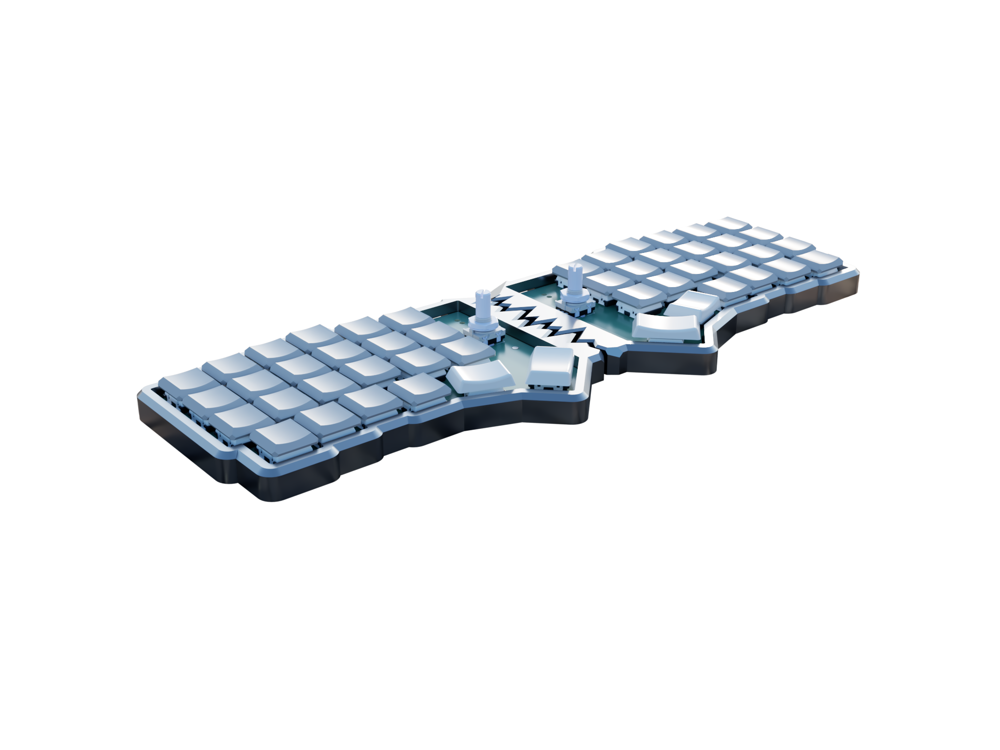
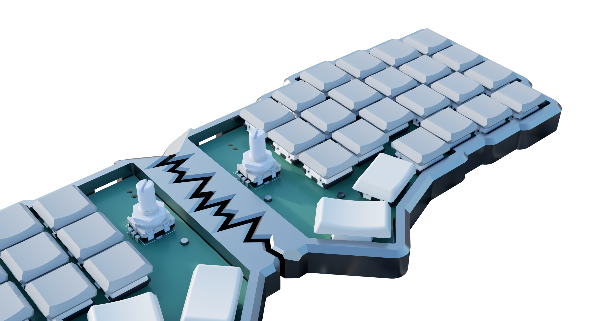
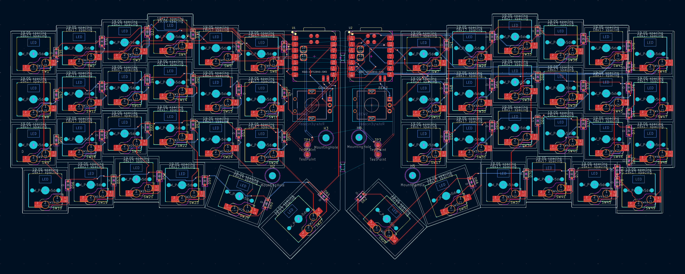
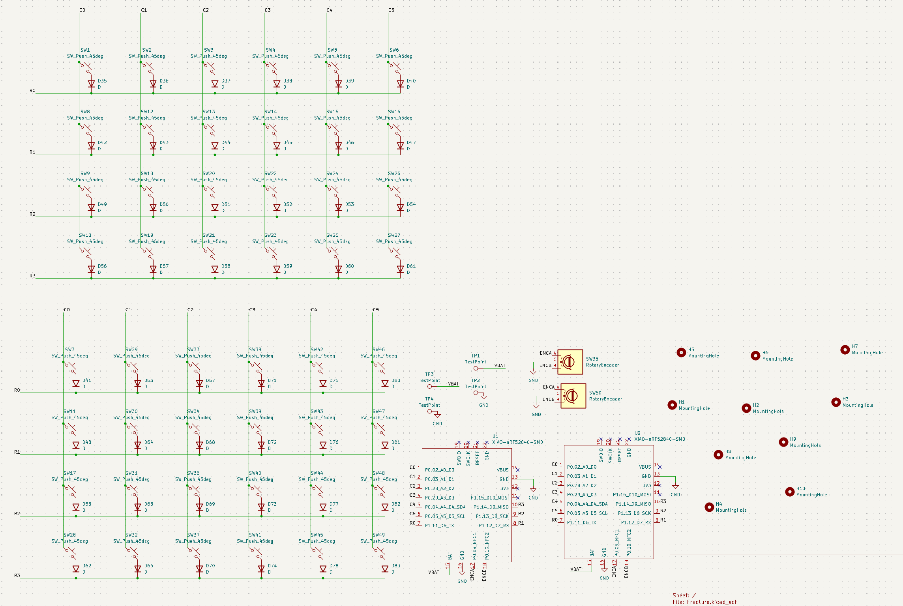
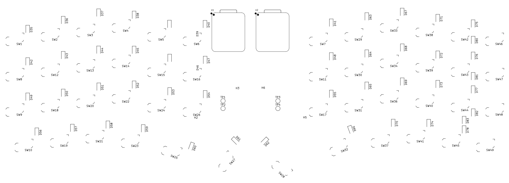

<div align="center">

# 

A Bluetooth Powered 48-Key Split Keyboard

<p>


</p>

### _A keyboard designed to physically split apart - because productivity and aesthetics shouldn't stay connected._


</div>

---

# Overview

**Fracture** is a wireless 48-key split mechanical keyboard built around modularity, portability, and aesthetics.

Unlike traditional keyboards, Fracture is designed to **literally seperate into two halves**, giving users a more ergonomic typing expereience while creating a visually unique "fractured" appearance.

Built using the **Seed Studio XIAO nRF52840**, Kailh Choc Switches, and low-profile keycaps, Fracture blends minimalism with functionaly in a compact wireless setup.

---

# Gallery

<div align="center">






</div>

---

# Zine

<div align="center">


</div>

---

# Motivation

Most keyboards are designed around a fixed layout.

Fracture was built around a different idea:

> _What if keyboard itself reflected flexibility?_

The split design is inspired from Corne keyboards:
- Better ergonomics
- Adjustable positioning
- Cleaner desk setups
- Compact portability
- A visually striking design language

The project also explores how industrial design and hardware aesthetics can coexist with practicality.

---

# Assembly Guide

## Hardware

### 1. Order the PCB

Navigate to:

```bash
PCB/Production/
```

Upload the included Gerber files to your preferred PCB manufacturer and order the PCB.

### 2. Order the Components
All required components and purchase links are available inside: (India)
```bash
PCB/BOM/BOM.csv
```
Order all listed parts before starting assembly
### 3. Solder the SMD Components

Start by soldering first few SMD components on the PCB:
- Diodes are on the front
- MCU pads are on the back

It is recommended to use:
- Flux
- Dine-tip soldering iron
- Tweezers

### 4. Install Hot-Swap Sockets
- Solder all Kailh hot-swap sockets onto the PCB carefully.

- Ensure every socket sits completely flat agains the PCB before soldering.

### 5. Install the Rotary Encoders

- Solder the EC11 rotary encoders in their designated positions.

- Make sure they are aligned staright before fully soldering.

### 6. Insert the MCU

- Now the XIAO nRF52840 (or any other if changed) controllers onto the PCB. 

### 7. Assemble the Case

- Print the 3D enclosure, and inert the PCB by aligning its M3 screw holes with the joints.

### 8. Install Switches

- Insert all Kailh Choc switches into the plate and hot-swap sockets.

- Check alignment carefully to avoid bent pins.

### 9. Install Keycaps

- Press the keycaps firmly onto the switches,

## Firmware Installation

### 1. Enter Bootloader Mode
While the keyboard is unplugged:

- Short the `BOOT` and `GND` pads using tweezers or screwdriver
- Plug in the USB cable

or

- Double press the reset button on the XIAO nRF52840

A new drive should appear on your computer

### 2. Download Firmware

Naviagte to:
```bash
Firmware/
```
and download `adafruit-circuitpython-Seeed_XIAO_nRF52840_Sense-en_US-10.2.1.uf2` or compile the files in `Firmware/Config` file if ZMK is to be used.

### 3. Flash the Firmware

Drag and drop the `uf2` file onto the mounted drive.
Repeat for the second half as well.

---

# BOM

|Designator                                                                                                                                                                                                                                                                           |Function        |Value                               |Footprint                              |Quantity|Price (INR)|Price (USD)|Amount |Link                                                                                                                                                            |
|-------------------------------------------------------------------------------------------------------------------------------------------------------------------------------------------------------------------------------------------------------------------------------------|----------------|------------------------------------|---------------------------------------|--------|-----------|-----------|-------|----------------------------------------------------------------------------------------------------------------------------------------------------------------|
|PCB                                                                                                                                                                                                                                                                                  |Main PCB        |                                    |                                       |1       |₹3,969.00  |$40.71     |$40.71 |https://www.pcbpower.com/page/PCBDetails/UXVvdGF0aW9ucw==/SU5RNjAzNTY0/                                                                                         |
|Keycaps u1 1                                                                                                                                                                                                                                                                         |Slim Keycaps    |Chocfox CFX Choc Blank Keycaps u1   |SW_choc_v1_HS_CPG135001S30_1u          |40      |₹35.00     |$0.36      |$14.36 |https://neomacro.in/products/chocfox-cfx-choc-blank-keycaps                                                                                                     |
|Keycaps u1 2                                                                                                                                                                                                                                                                         |Slim Keycaps    |Chocfox CFX Choc Blank Keycaps u1   |SW_choc_v1_HS_CPG135001S30_1u          |4       |₹35.00     |$0.36      |$1.44  |https://neomacro.in/products/chocfox-cfx-choc-blank-keycaps?variant=48049351590166                                                                              |
|Keycaps u1.25                                                                                                                                                                                                                                                                        |Slim Keycaps    |Chocfox CFX Choc Blank Keycaps u1.25|SW_choc_v1_HS_CPG135001S30_1.25u       |2       |₹55.00     |$0.56      |$1.13  |https://neomacro.in/products/chocfox-cfx-choc-blank-keycaps?variant=48049351622934                                                                              |
|Keycaps u1.5                                                                                                                                                                                                                                                                         |Slim Keycaps    |Chocfox CFX Choc Blank Keycaps u1.5 |SW_choc_v1_HS_CPG135001S30_1.5u        |2       |₹55.00     |$0.56      |$1.13  |https://neomacro.in/products/chocfox-cfx-choc-blank-keycaps?variant=48049351655702                                                                              |
|Enclosure                                                                                                                                                                                                                                                                            |Print Legion    |                                    |                                       |1       |₹400.00    |$4.10      |$4.10  |https://printlegion.hackclub.com/                                                                                                                               |
|D35, D36, D37, D38, D39, D40, D41, D42, D43, D44, D45, D46, D47, D48, D49, D50, D51, D52, D53, D54, D55, D56, D57, D58, D59, D60, D61, D62, D63, D64, D65, D66, D67, D68, D69, D70, D71, D72, D73, D74, D75, D76, D77, D78, D80, D81, D82, D83                                       |Diodes          |1N4148W                             |D_SOD-123                              |48      |₹0.70      |$0.01      |$0.34  |https://robu.in/product/1n4148w-sod-123-1206-diodereel-of-3000/                                                                                                 |
|SW1, SW2, SW3, SW4, SW5, SW6, SW7, SW8, SW9, SW10, SW11, SW12, SW13, SW14, SW15, SW16, SW17, SW18, SW19, SW20, SW21, SW22, SW23, SW24, SW26, SW29, SW30, SW31, SW33, SW34, SW36, SW37, SW38, SW39, SW40, SW41, SW42, SW43, SW44, SW45, SW46, SW47, SW48, SW49, SW25, SW32, SW27, SW28|Keys            |Kailh Choc u1                       |SW_choc_v1_HS_CPG135001S30             |44      |₹54.55     |$0.56      |$24.62 |https://neomacro.in/products/kailh-choc-v1-switches                                                                                                             |
|SW35, SW50                                                                                                                                                                                                                                                                           |Rotary Encoders |EC11                                |RotaryEncoder_Alps_EC11E_Vertical_H20mm|2       |₹42.00     |$0.43      |$0.86  |https://www.flyrobo.in/ec11-rotary-encoder-half-shaft-handle-potentiometer-15mm?tracking=ads&srsltid=AfmBOorjqwhfobDZ2HP5h3FZMTYz27RTBOT3YmNnFShFGbmHEdoPsKBgEZg|
|U1, U2                                                                                                                                                                                                                                                                               |MCU             |XIAO nRF52840                       |modified-XIAO-nRF52840-SMD             |2       |₹1,152.00  |$11.82     |$23.63 |https://robu.in/product/seeed-studio-xiao-ble-nrf52840/                                                                                                         |
|SW1, SW2, SW3, SW4, SW5, SW6, SW7, SW8, SW9, SW10, SW11, SW12, SW13, SW14, SW15, SW16, SW17, SW18, SW19, SW20, SW21, SW22, SW23, SW24, SW26, SW29, SW30, SW31, SW33, SW34, SW36, SW37, SW38, SW39, SW40, SW41, SW42, SW43, SW44, SW45, SW46, SW47, SW48, SW49                        |Hot-swap Sockets|Kailh HS choc v1                    |SW_choc_v1_HS_CPG135001S30             |48      |₹14.00     |$0.14      |$6.89  |https://neomacro.in/products/kailh-choc-pg1350-hot-swap-sockets?variant=48049369907478                                                                          |
|TOTAL                                                                                                                                                                                                                                                                                |                |                                    |                                       |        |           |           |$119.21|                                                                                                                                                                |
---

# Features

- **Physically Splits Into Two Halves**
- **Bluetooth Powered**
- **48-Key Layout**
- **Rotary Encoders**
- **Low Profile Kailh Choc Switches**
- **Kailh Hot-Swap Sockets**
- **Powered by XIAO nRF52840**
- **Custom Themed Enclosure**
- **Slim Keycaps**
- **Portable & Lightweigth**
- **Fully Custom PCB**

___


# Hardware Stack

| Component | Description |
|---|---|
| MCU | Seeed Studio XIAO nRF52840 |
| Switches | Kailh Choc Low Profile |
| Sockets | Kailh Hot Swap Sockets |
| Layout | 48-key Split |
| Connectivity | Bluetooth |
| Encoders | Rotary Encoders (360 Degree Rotary Encoder EC16)
| Keycaps | Slim Low-Profile Keycaps |
| PCB | Custom Designes |
| Case | Themed Fracture Enclosure |

---

# PCB Design

The PCB was custom designed specifically for the Fracture layout and enclosure.

Features include:
- Wireless microcontroller support
- Rotary encoder integration
- Kailh hot-swap compatibility
- Compact routing for slip profile construction

## PCB


## Schematic


## Placement


---

# Enclosure

The enclosure follows the central "fracture" design language:
- Broken center seam
- Aggresive angular styling
- Compact low-profile body
- Seamless split mechanism


The goal was to make the keyboard feel more like a designed object rather than just a perpheral.

---

# Firmware (ZMK)

Firmware features:
- Bluetooth support
- Custom keymaps
- Layer switching
- Encoder controls

---

```bash
Fracture/
├── PCB/
├── CAD/
├── Firmware/
├── Assets/
└── README.md
```

---

# Current Status

- [X] Inital Concept
- [X] Layout Finalized
- [X] Enclosure Prototype
- [X] PCB design
- [X] Firmware
- [ ] Final Build
- [ ] Firmware Optimization

---

# Contributing 

Contributions, suggestions, and feedback are welcome.

If you'd like to improve Fracture:
1. Fork or Clone the repository 
```bash
git clone https://github.com/Sudo-Aju/Fracture.git
cd Fracture
```
2. Create your feature branch (if forked)
3. Commit your changes
4. Open a pull request

---

# Creator

### Azmeer Pirani
17 • India • @fallout

Built with a love for:
- hardware design
- industrial aesthetics
- mechanical keyboards
- expirimental products

---

# License

This project is licensed under the MIT License.

---

<div align="center">

## FRACTURE

### _Break the keyboard. Not the workflow._

</div>
