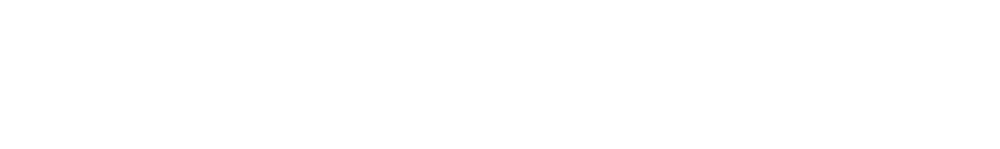
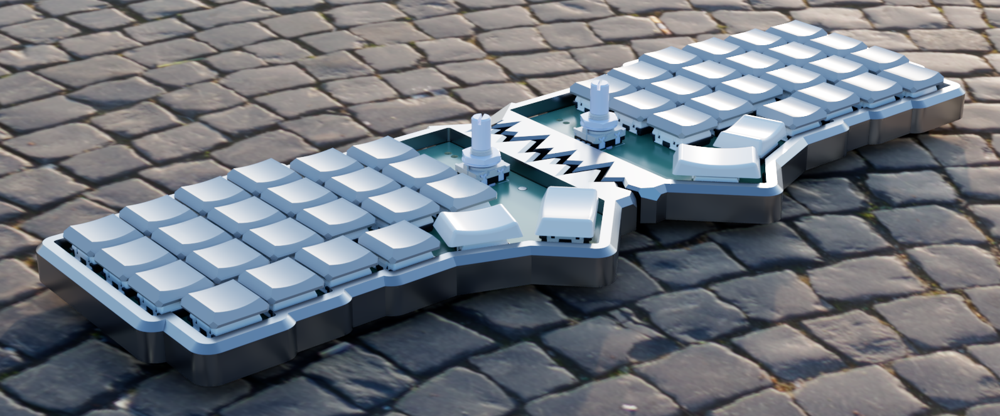
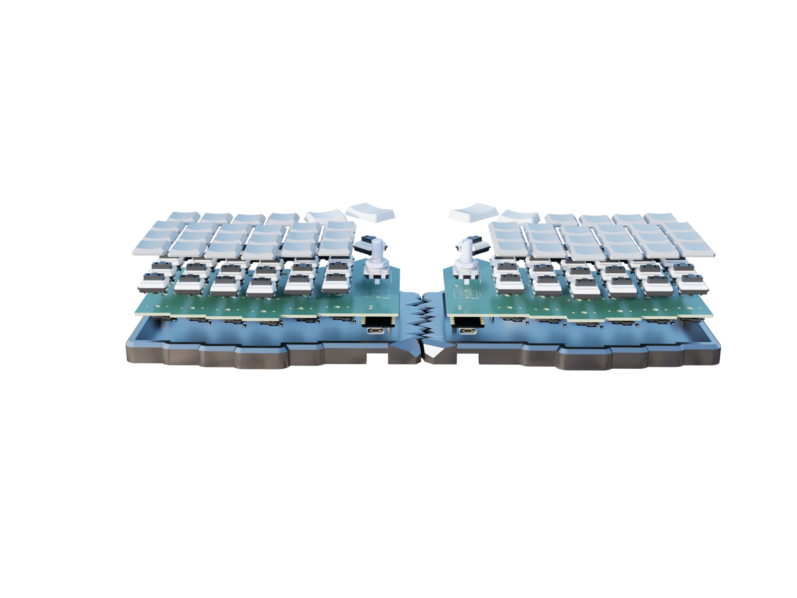
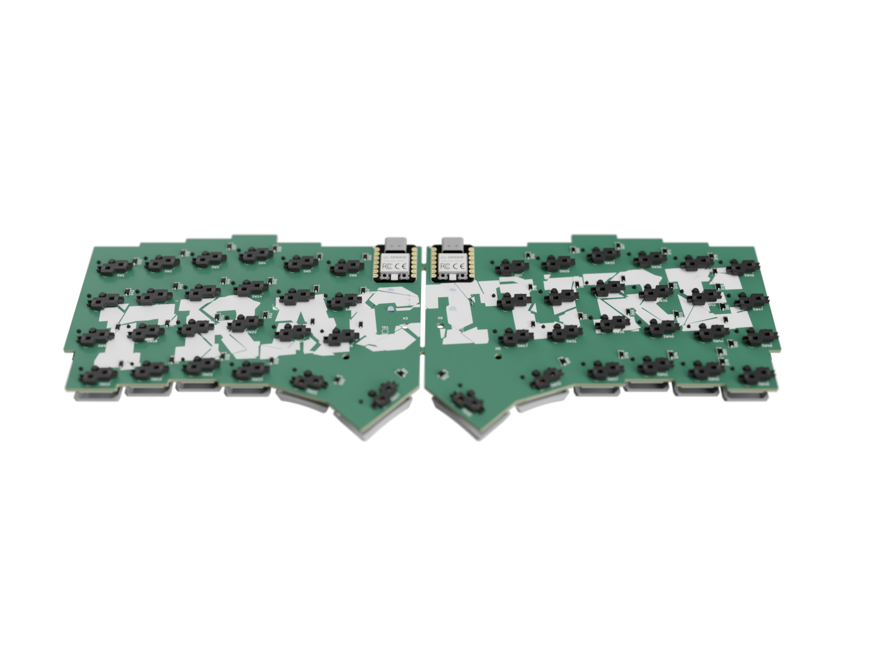
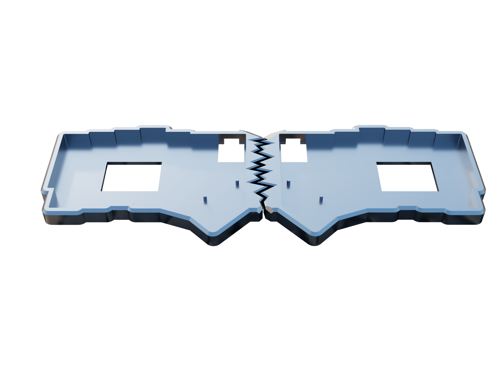
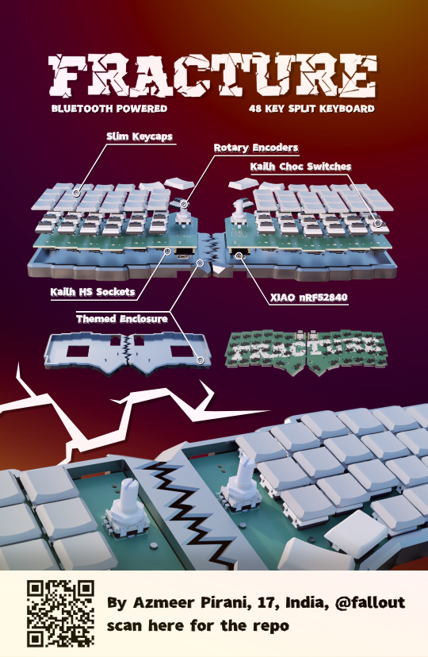

<div align="center">

# 

A Bluetooth Powered 48-Key Split Keyboard

<p>


</p>

### _A keyboard designed to physically split apart - because productivity and aesthetics shouldn't stay connected._

</div>

---

# Preview

<div align="center">



</div>

---

# Overview

**Fracture** is a wireless 48-key split mechanical keyboard built around modularity, portability, and aesthetics.

Unlike traditional keyboards, Fracture is designed to **literally seperate into two halves**, giving users a more ergonomic typing expereience while creating a visually unique "fractured" appearance.

Built using the **Seed Studio XIAO nRF52840**, Kailh Choc Switches, and low-profile keycaps, Fracture blends minimalism with functionaly in a compact wireless setup.

---

# Inspiration

Most keyboards are designed around a fixed layout.

Fracture was built around a different idea:

> _What if keyboard itself reflected flexibility?_

The split design is inspired from Corne keyboards:
- Better ergonomics
- Adjustable positioning
- Cleaner desk setups
- Compact portability
- A visually striking design language

The project also explores how industrial design and hardware aesthetics can coexist with practicality.

---

# Features

- **Physically Splits Into Two Halves**
- **Bluetooth Powered**
- **48-Key Layout**
- **Rotary Encoders**
- **Low Profile Kailh Choc Switches**
- **Kailh Hot-Swap Sockets**
- **Powered by XIAO nRF52840**
- **Custom Themed Enclosure**
- **Slim Keycaps**
- **Portable & Lightweigth**
- **Fully Custom PCB**

---

# Gallery

<div align="center">





</div>

___


# Hardware Stack

| Component | Description |
|---|---|
| MCU | Seeed Studio XIAO nRF52840 |
| Switches | Kailh Choc Low Profile |
| Sockets | Kailh Hot Swap Sockets |
| Layout | 48-key Split |
| Connectivity | Bluetooth |
| Encoders | Rotary Encoders (360 Degree Rotary Encoder EC16)
| Keycaps | Slim Low-Profile Keycaps |
| PCB | Custom Designes |
| Case | Themed Fracture Enclosure |

---

# Zine

<div align="center">



</div>

---

# Design Philosophy

Fracture was designed around three core ideas:

## 1. Ergonomics
The split layout allows natural hand positioning, reducing strain during long typing sessions.

## 2. Modularity
Hot-swap sockets and detachable halves make the keyboard adaptable and repairable.

## 3. Identity
instead of looking like a generic keyboard, Fracture embraces an aggresive fractured visual style inspired by broken surfaces and asymmetry.

---

# PCB Design

The PCB was custom designed specifically for the Fracture layout and enclosure.

Features include:
- Wireless microcontroller support
- Rotary encoder integration
- Kailh hot-swap compatibility
- Compact routing for slip profile construction

---

# Enclosure

The enclosure follows the central "fracture" design language:
- Broken center seam
- Aggresive angular styling
- Compact low-profile body
- Seamless split mechanism

The goal was to make the keyboard feel more like a designed object rather than just a perpheral.

---

# Firmware (QMK)

Firmware features:
- Bluetooth support
- Custom keymaps
- Layer switching
- Encoder controls
- VIA / Vial compatibility *(planned)*

---

```bash
Fracture/
├── PCB/
├── CAD/
├── Firmware/
├── Assets/
├── Docs/
└── README.md
```

---

# Current Status

Fracture is currently been designed and is yet to be built.

---

# Contributing 

Contributions, suggestions, and feedback are welcome.

If you'd like to improve Fracture:
1. Fork or Clone the repository 
```bash
git clone https://github.com/Sudo-Aju/Fracture.git
cd Fracture
```
2. Create your feature branch (if forked)
3. Commit your changes
4. Open a pull request

---

# Creator

### Azmeer Pirani
17 • India • @fallout

Built with a love for:
- hardware design
- industrial aesthetics
- mechanical keyboards
- expirimental products

---

# License

This project is licensed under the MIT License.

---

<div align="center">

## FRACTURE

### _Break the keyboard. Not the workflow._

</div>
